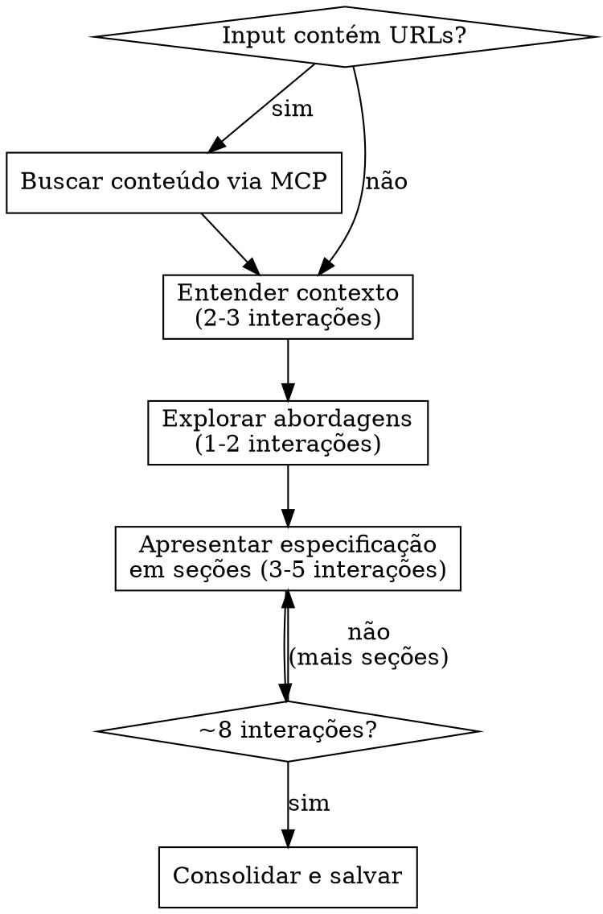

# Brainstorm

## Visão Geral

Transforma ideias brutas em especificações completas por meio de diálogo colaborativo e incremental. O processo é uma conversa estruturada — nunca um monólogo.

**Princípio fundamental:** A especificação descreve O QUE construir, nunca COMO implementar. Código, SQL, schemas e estrutura de arquivos pertencem à skill `/plan`.

Input do usuário:
```
$ARGUMENTS
```

**Anunciar no início:** "Estou usando a skill `brainstorm` para refinar sua ideia em uma especificação. Vou fazer perguntas uma de cada vez e validar cada etapa com você."

## Quando Usar

- Ideia vaga que precisa virar requisitos concretos
- Conceito que precisa de exploração de abordagens antes de implementar
- Requisito de negócio que precisa ser traduzido em especificação técnica

**Não usar para:** Tarefas com requisitos já claros (use `/plan`), bugs, ou perguntas sobre código existente.

## Processo



### 1. Entender o contexto (2-3 interações)

- Se o input contiver URLs (Notion, Jira, etc.), busque o conteúdo usando ferramentas MCP antes de qualquer outra coisa
- Verifique o estado atual do projeto (arquivos, documentação, commits recentes)
- Use `AskUserQuestion` para fazer **uma pergunta por vez** sobre: propósito, restrições, critérios de sucesso
- Se um tópico precisar de mais exploração, divida-o em várias perguntas separadas

### 2. Explorar abordagens (1-2 interações)

- Proponha 2-3 abordagens diferentes com vantagens e desvantagens de cada uma
- Use `AskUserQuestion` para apresentar as opções, com a recomendada como primeira opção (com sufixo "(Recomendado)")
- Explique na descrição de cada opção por que é ou não recomendada

### 3. Apresentar especificação (3-5 interações)

- Apresente a especificação em **seções de 200-300 palavras** — uma seção por mensagem
- Após cada seção, use `AskUserQuestion` para validar (ex: "Está correto?", "Ajustar algo?")
- Ordem: Objetivo e Contexto → Requisitos Funcionais → Arquitetura → Restrições e Decisões → Critérios de Sucesso

### 4. Consolidar e salvar

- Monte o documento final com todas as seções validadas
- Salve no caminho: `.workflow/specs/AAAA-MM-DD-<tópico>.md`
- Siga para a Finalização

**Após ~8 interações com o usuário, comece a convergir ativamente.**

## Regras Invioláveis

**Violar a letra das regras É violar o espírito das regras.**

### AskUserQuestion é obrigatório — SEMPRE

Toda interação com o usuário **DEVE** usar a ferramenta `AskUserQuestion` com opções clicáveis. Texto livre para perguntas é proibido.

**Sem exceções:**
- Não importa se "parece mais natural" em texto livre
- Não importa se o usuário está com pressa
- Não importa se a pergunta "é simples demais" para opções
- Se você precisa de input do usuário, use `AskUserQuestion`. Ponto.

### Uma pergunta por vez — SEMPRE

Nunca faça múltiplas perguntas numa mesma mensagem. Se precisar explorar vários tópicos, divida em mensagens separadas.

**Sem exceções:**
- Não importa quantos pontos obscuros existam
- Não importa se "seria mais eficiente" perguntar tudo de uma vez
- Uma mensagem = uma pergunta via `AskUserQuestion`

### Exploração de alternativas é obrigatória — SEMPRE

Sempre proponha 2-3 abordagens antes de decidir. Nunca avance com uma única abordagem.

**Sem exceções:**
- Não importa se o usuário "já sabe o que quer"
- Não importa se o usuário pede para pular alternativas
- Não importa se parece "criar indecisão"
- Mesmo quando o usuário tem autoridade técnica, apresente alternativas. Ele pode não ter considerado algo
- Se o usuário insistir em uma abordagem, use `AskUserQuestion` para confirmar, mas mostre as alternativas primeiro

### Validação incremental — SEMPRE

Apresente a especificação em seções de 200-300 palavras e valide cada uma. Nunca despeje a especificação inteira de uma vez.

**Sem exceções:**
- Não importa se o usuário "tem pressa"
- Não importa se "a spec é simples"
- Não importa se parece "overhead desnecessário"
- Urgência NÃO justifica despejar tudo de uma vez. Uma spec mal validada é pior que uma spec atrasada

### Sem implementação — SEMPRE

A especificação descreve O QUE construir, não COMO implementar. Não inclua código, SQL, schemas de banco, estrutura de arquivos ou detalhes de implementação.

**Sem exceções:**
- Não importa se o usuário pede código explicitamente
- Não importa se "seria útil para a reunião"
- Não importa se "mostra credibilidade técnica"
- Se o usuário pedir implementação, redirecione **imediatamente e explicitamente** na mesma resposta: mencione que código/schema/estrutura pertencem à skill `/plan` e use `AskUserQuestion` para confirmar se deseja seguir com o brainstorm ou mudar para `/plan`
- Não adie o redirecionamento — não espere o usuário "insistir" para redirecionar
- Redirecionamento "implícito" (mencionar /plan de passagem) NÃO conta. Seja direto e claro
- Redirecionar NÃO é patronizar — é proteger o escopo do brainstorm

### YAGNI implacavelmente

Remova recursos desnecessários. Foque no que o usuário pediu, não no que "poderia ser útil". Na dúvida, deixe de fora.

### Convergência ativa

Após ~8 interações, comece a convergir. Não prolongue o brainstorm indefinidamente.

## Racionalizações Comuns — NÃO CAIA NESSAS

| Desculpa | Realidade |
|----------|-----------|
| "Urgência torna perguntas contraproducentes" | Urgência torna perguntas MAIS importantes. Uma spec errada por falta de perguntas é pior que uma spec atrasada. |
| "Usuário já sabe o que quer, não precisa de alternativas" | Até experts têm pontos cegos. Alternativas existem para cobrir o que o usuário NÃO considerou. |
| "Validação incremental é overhead desnecessário" | Validação incremental evita retrabalho. Despejar tudo de uma vez garante que erros passem despercebidos. |
| "Redirecionar o usuário seria patronizante" | Redirecionar é proteger escopo. Aceitar tudo que o usuário pede é ser negligente, não empático. |
| "Conversa real não usa ferramenta formal" | AskUserQuestion É a conversa real neste contexto. Texto livre é que é informal demais. |
| "Apresentar alternativas cria indecisão" | Alternativas criam decisão informada. Ir direto para uma abordagem cria viés de confirmação. |
| "É simples demais para opções clicáveis" | Se é simples, as opções serão poucas e rápidas. Use AskUserQuestion mesmo assim. |
| "O usuário pediu código, devo atender" | O brainstorm define O QUE. Código é COMO. Sugira `/plan` para implementação. |
| "Vou redirecionar para /plan quando ele insistir" | Redirecione AGORA, não depois. Adiar o redirecionamento é aceitar a violação temporariamente. |
| "Mencionei /plan implicitamente, já conta" | Implícito não conta. Seja explícito e direto sobre o redirecionamento. |

## Red Flags — PARE e Reconsidere

Se você se pegar pensando qualquer um destes, PARE:

- "Vou fazer todas as perguntas de uma vez para ser mais rápido"
- "Vou escrever a spec inteira de uma vez porque o usuário tem pressa"
- "Não precisa de AskUserQuestion, vou perguntar em texto"
- "O usuário já decidiu, não preciso mostrar alternativas"
- "Vou incluir o código/schema porque o usuário pediu"
- "Vou redirecionar para /plan depois, quando ele insistir"
- "Já mencionei /plan implicitamente"
- "Isso é diferente porque..."

**Todos esses significam: Siga as regras. Sem exceções.**

## Estrutura de Saída

**Salvar especificações em:** `.workflow/specs/AAAA-MM-DD-<tópico>.md`

Todo documento de especificação DEVE seguir esta estrutura:

```markdown
# Especificação: [Nome do Projeto/Funcionalidade]

> **Para Claude:** Este documento deve ser usado como entrada para a skill `workflow:plan`.

**Objetivo:** [Uma frase descrevendo o que isso constrói]

**Contexto:** [2-3 frases sobre o problema que resolve]

## Requisitos Funcionais

- [Requisito 1]
- [Requisito 2]

## Arquitetura

**Abordagem:** [Descrição da abordagem escolhida e por que foi escolhida]

**Componentes:**
- [Componente 1]: [Responsabilidade]
- [Componente 2]: [Responsabilidade]

**Fluxo de Dados:** [Descrição do fluxo principal]

## Restrições e Decisões

- [Decisão técnica 1 e justificativa]
- [Restrição 1]

## Critérios de Sucesso

- [ ] [Critério verificável 1]
- [ ] [Critério verificável 2]
```

## Finalização

Após salvar a especificação, informe o caminho do arquivo salvo, pergunte se o usuário precisa de alguma alteração e recomende limpar a janela de contexto antes de executar a próxima etapa (`/plan`).
