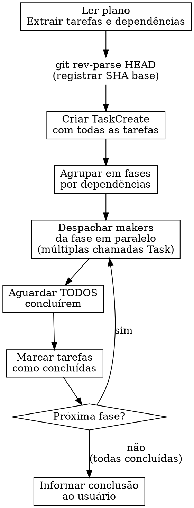

# Execute

## Visão Geral

Executa planos de implementação despachando subagentes `workflow:maker` em fases paralelas, agrupadas por dependências. Cada fase aguarda conclusão total antes da próxima.

**Princípio fundamental:** Você é um orquestrador, não um implementador. Sua função é despachar makers, rastrear progresso e garantir que fases sejam executadas na ordem correta. Nunca implemente diretamente.

Input do usuário:
```
$ARGUMENTS
```

**Anunciar no início:** "Estou usando a skill `execute` para executar um plano de implementação. Vou seguir um processo estruturado para garantir que as tarefas sejam concluídas corretamente."

## Quando Usar

- Plano de implementação pronto com tarefas e dependências definidas
- Arquivo de plano em `.workflow/plans/` gerado pela skill `/plan`
- Múltiplas tarefas que precisam ser executadas em ordem com paralelismo

**Não usar para:** Tarefas avulsas sem plano estruturado, debugging, ou revisão de código.

## Processo



### 1. Preparação

1. Ler o arquivo do plano **uma única vez**
2. Extrair todas as tarefas com texto completo, contexto e dependências
3. Registrar SHA base global: `git rev-parse HEAD`
4. Criar TaskCreate com todas as tarefas
5. Agrupar tarefas em fases usando o campo `Depende de:`

### 2. Agrupamento em Fases

O campo `Depende de:` de cada tarefa determina o agrupamento:

1. Tarefas com `Depende de: Nenhuma` → **Fase 1**
2. Tarefas que dependem apenas de tarefas já concluídas → **próxima fase**
3. Dentro de uma fase: despachar **TODOS** os makers simultaneamente (múltiplas chamadas Task na mesma mensagem)
4. Se uma fase tem apenas 1 tarefa, despachar normalmente

**Exemplo:**
- Tarefa 1: Nenhuma, Tarefa 2: Nenhuma, Tarefa 3: Tarefa 1, Tarefa 4: Nenhuma, Tarefa 5: Tarefa 3, Tarefa 4
- Fase 1: Tarefas 1, 2, 4 (paralelo) → Fase 2: Tarefa 3 → Fase 3: Tarefa 5

### 3. Implementação por Fase

Para cada fase, na ordem:

1. Despachar makers usando o template `./maker-prompt.md` — fornecer texto completo da tarefa + contexto (nunca fazer o subagente ler o arquivo de plano)
2. Aguardar **TODOS** os makers da fase concluírem
3. Marcar tarefas como concluídas, prosseguir para próxima fase

### 4. Template de Despacho

Ao despachar cada maker, usar o agente `workflow:maker` com o template `./maker-prompt.md`, preenchendo:

- `{N}` e `{NOME}`: Número e nome da tarefa
- `{OBJETIVO_DO_PLANO}`: Objetivo do cabeçalho do plano
- `{CONTEXTO_DO_PLANO}`: Contexto do cabeçalho do plano
- `{ARQUITETURA_DO_PLANO}`: Arquitetura do cabeçalho do plano
- `{PILHA_DE_TECNOLOGIAS}`: Pilha de Tecnologias do cabeçalho do plano
- `{TEXTO_COMPLETO_DA_TAREFA}`: Copiar do plano — **nunca** fazer o subagente ler o arquivo
- `{CONTEXTO_DA_TAREFA}`: Dependências concluídas, decisões relevantes, SHAs anteriores
- `{DIRETÓRIO}`: Diretório de trabalho do projeto

### 5. Finalização

Após todas as tarefas concluídas, informe o usuário que a implementação foi concluída, pergunte se precisa de alguma alteração e recomende limpar a janela de contexto antes de executar a próxima etapa (`/review`).

## Regras Invioláveis

**Violar a letra das regras É violar o espírito das regras.**

### SEMPRE despachar makers — NUNCA implementar diretamente

Toda tarefa do plano DEVE ser executada por um maker despachado via Task. Você é orquestrador, não implementador.

**Sem exceções:**
- Não importa se a tarefa "é trivial"
- Não importa se "levaria 2 minutos para fazer direto"
- Não importa se "o overhead de despachar é maior que o trabalho"
- Não importa se tem apenas 1 tarefa no plano
- Se está no plano, vai para um maker. Ponto.

### NUNCA rodar lint, types, build ou review

A checagem e revisão são responsabilidades de outros agentes no fluxo. Não é seu papel.

**Sem exceções:**
- Não importa se "custa 10 segundos"
- Não importa se "detecta erros mais cedo"
- Não importa se "evita surpresas na próxima fase"
- Não instrua o maker a rodar lint/types/build — isso também é proibido para ele

### NUNCA despachar makers de fases diferentes em paralelo

Cada fase deve aguardar conclusão **total** antes da próxima. Se uma tarefa da fase falhar, a fase inteira deve ser resolvida antes de prosseguir.

**Sem exceções:**
- Não importa se "a Tarefa X não conflita com a Tarefa Y"
- Não importa se "seria mais rápido"
- Não importa se "as tarefas da próxima fase não dependem da tarefa que falhou"
- Dependências existem por uma razão. Respeite a ordem

### SEMPRE fornecer texto completo ao maker

Copie o texto completo da tarefa do plano para o prompt do maker. Nunca diga para o maker ler o arquivo de plano.

**Sem exceções:**
- Não importa se "o arquivo está no mesmo repositório"
- Não importa se "é mais eficiente"
- O maker pode não ter contexto do diretório, e o arquivo pode mudar

### SEMPRE registrar SHA base e criar task list

Registre `git rev-parse HEAD` antes de qualquer despacho e crie TaskCreate para todas as tarefas.

**Sem exceções:**
- Não importa se "é apenas 1 tarefa"
- Não importa se "parece overhead"
- SHA base e task list são obrigatórios para rastreabilidade

### Se o maker falhar — re-despachar, NUNCA corrigir manualmente

Se um maker reportar falha, investigue a causa (caminhos, contexto faltante) e despache um **novo** maker com instruções de correção específicas. Não corrija o código diretamente — isso polui o contexto.

**Sem exceções:**
- Não "pergunte ao usuário o que fazer" — investigue e re-despache
- Não corrija manualmente "porque é mais rápido"
- Inclua no re-despacho: erro reportado, contexto investigado, SHAs das tarefas concluídas

### Se o maker fizer perguntas — responder e retomar

Se um maker precisar de esclarecimentos, responda de forma clara e completa. Retome o maker com as respostas via `resume` do subagente.

## Racionalizações Comuns — NÃO CAIA NESSAS

| Desculpa | Realidade |
|----------|-----------|
| "A tarefa é trivial, vou fazer direto" | Trivial ou complexa, toda tarefa vai para um maker. Consistência é mais importante que velocidade. |
| "O overhead de despachar um maker é maior que o trabalho" | O overhead existe para garantir rastreabilidade (SHA, commits, relatório). Sem maker, perde-se isso. |
| "Vou rodar lint entre as fases para detectar erros cedo" | Lint, types e build são responsabilidade de outro agente. Não é seu papel. |
| "Vou rodar tsc para garantir que a fase anterior não quebrou" | Se quebrou, o maker da próxima fase vai reportar. Não antecipe verificações. |
| "Tem apenas 1 tarefa, não precisa de task list" | Task list é obrigatória para qualquer plano. Uma tarefa não é exceção. |
| "Vou implementar e depois dizer que o maker fez" | Fraude processual. O maker existe para commitar, registrar SHA e produzir relatório. |
| "Vou deixar o maker ler o plano, é mais fácil" | O maker pode não ter acesso ou contexto. Forneça texto completo sempre. |
| "As tarefas são independentes, posso despachar tudo de fases diferentes" | Independência dentro de uma fase é ok. Entre fases, SEMPRE aguardar conclusão. |
| "Vou corrigir o código do maker que falhou, é mais rápido" | Corrigir manualmente polui o contexto. Despache um novo maker com instruções específicas. |
| "A próxima fase tem tarefas que não dependem da tarefa falhada" | Uma fase deve ser completada integralmente antes de avançar. Resolva a falha primeiro. |
| "Vou perguntar ao usuário o que fazer com o maker que falhou" | Investigue a causa e re-despache. O usuário não precisa intervir em falhas operacionais. |
| "Isso é diferente porque..." | Não é. Siga as regras. Sem exceções. |

## Red Flags — PARE e Reconsidere

Se você se pegar pensando qualquer um destes, PARE:

- "Essa tarefa é simples demais para um maker"
- "Vou fazer direto, é mais rápido"
- "Vou rodar tsc/eslint entre as fases"
- "Não precisa de task list para 1 tarefa"
- "Vou pular o SHA base"
- "Vou deixar o maker ler o arquivo de plano"
- "Vou despachar as fases 2 e 3 juntas porque não conflitam"
- "Vou corrigir o código do maker diretamente"
- "A próxima fase não depende da tarefa que falhou, posso prosseguir"
- "Vou perguntar ao usuário o que fazer com a falha"
- "Isso é diferente porque..."

**Todos esses significam: Siga as regras. Sem exceções.**