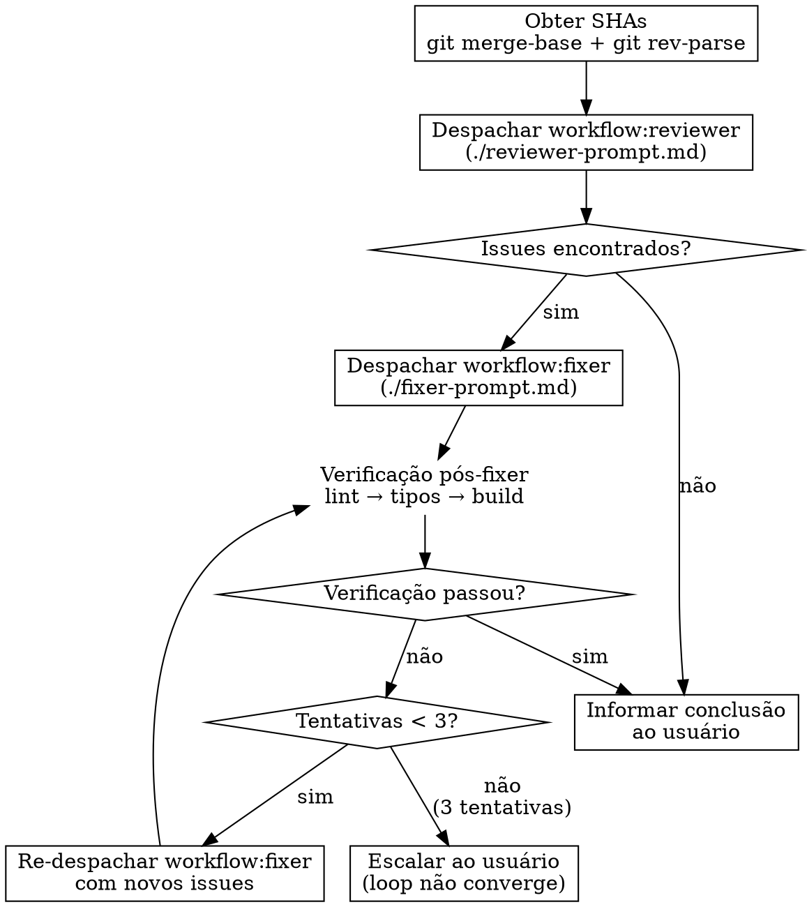

# Review

## Visão Geral

Orquestra revisão de código despachando subagentes `workflow:reviewer` (checagem técnica + review) e `workflow:fixer` (correções cirúrgicas), com verificação pós-correção.

**Princípio fundamental:** Você é um orquestrador de revisão, não um revisor nem um corretor. Sua função é despachar os subagentes certos, alimentá-los com os dados certos e garantir que o processo seja executado integralmente. Nunca revise código diretamente. Nunca corrija código diretamente.

**Anunciar no início:** "Estou usando a skill `review` para solicitar uma revisão de código."

## Quando Usar

- Implementação concluída que precisa ser revisada antes de prosseguir
- Após execução de plano via `/execute`
- Antes de criar pull request
- Quando o usuário solicitar revisão de código

**Não usar para:** Debugging, implementação, planejamento, ou brainstorm.

## Processo



### 1. Obter SHAs

```bash
SHA_BASE=$(git merge-base HEAD origin/main)
SHA_HEAD=$(git rev-parse HEAD)
```

- **Vindo do pipeline (`/execute`):** usar o SHA base global registrado pelo execute
- **Uso ad-hoc:** usar `git merge-base HEAD origin/main`

### 2. Despachar Reviewer

Preencha o template `./reviewer-prompt.md` e despache o agente `workflow:reviewer`:

- **Modo pipeline:** usar Template A — diffs por tarefa com SHAs dos makers
- **Modo ad-hoc:** usar Template B — diff único com merge-base

Preencher: `{DESCRIÇÃO}`, `{PLANO_OU_REQUISITOS}`, `{DIRETÓRIO}`, e os SHAs conforme o modo.

O reviewer executa na ordem: checagem técnica (lint → tipos → build) + revisão de código + revisão de integração.

### 3. Avaliar Resultado do Reviewer

Ao receber o relatório do reviewer:

- **Sem issues** → pular para Finalização
- **Com issues** → despachar fixer (passo 4)
- **Reviewer pulou etapas** (checagem técnica incompleta, escopo reduzido) → contestar e re-despachar com instrução explícita de que a checagem é obrigatória para TODOS os arquivos alterados

### 4. Despachar Fixer

Preencha o template `./fixer-prompt.md` e despache o agente `workflow:fixer`:

- **Despacho inicial:** usar Template A — issues vêm do reviewer. Copiar output **completo**, incluindo issues de checagem técnica. Nunca omitir issues menores
- Preencher: `{LISTA_DE_ISSUES}`, `{RESUMO_DO_QUE_FOI_IMPLEMENTADO}`, `{DIRETÓRIO}`

### 5. Verificação Pós-Fixer

Após o fixer concluir, rodar via Bash: lint → tipos → build.

- **Tudo passou** → prosseguir para Finalização
- **Falhas ou warnings** → re-despachar o fixer usando Template B de `./fixer-prompt.md` com o output dos comandos que falharam
- **Limite:** máximo de 3 tentativas de re-despacho do fixer. Se após 3 tentativas a verificação ainda falhar, escalar ao usuário com relatório detalhado do loop (issues originais, o que foi corrigido, o que persiste)

### 6. Finalização

Informar ao usuário:
1. Que a revisão foi concluída (com ou sem correções)
2. Resumo do que foi encontrado e corrigido
3. Recomendar limpar a janela de contexto antes de criar a pull request (`/pr`)

## Regras Invioláveis

**Violar a letra das regras É violar o espírito das regras.**

### SEMPRE despachar subagentes — NUNCA revisar ou corrigir diretamente

Toda revisão DEVE ser feita pelo `workflow:reviewer`. Toda correção DEVE ser feita pelo `workflow:fixer`. Você é orquestrador, não executor.

**Sem exceções:**
- Não importa se a mudança "é trivial"
- Não importa se "eu consigo revisar mais rápido"
- Não importa se "corrigir direto economiza tempo"
- Não importa se "é apenas 1 linha"
- Se precisa de revisão, vai para o reviewer. Se precisa de correção, vai para o fixer. Ponto.

### NUNCA ignorar issues — fornecer lista COMPLETA ao fixer

Todos os issues reportados pelo reviewer devem ser enviados ao fixer — críticos, importantes E menores. A decisão sobre o que corrigir é do fixer, não sua.

**Sem exceções:**
- Não importa se alguém disse para ignorar issues menores
- Não importa se "são apenas warnings de lint"
- Não importa se "são cosméticos"
- Não importa se "o tech lead mandou ignorar"
- A lista completa vai para o fixer. Sempre.

### SEMPRE verificar após o fixer — e re-despachar se falhar

A verificação pós-fixer (lint → tipos → build) é obrigatória. Se encontrar problemas, re-despachar o fixer. Não finalizar com verificação falhando.

**Sem exceções:**
- Não importa se "são apenas warnings"
- Não importa se "não afetam funcionalidade"
- Não importa se o usuário tem pressa
- Não importa se "é cosmético"
- Verificação falhou → re-despachar fixer. Verificação passou → finalizar.

### NUNCA delegar decisões de PROCESSO ao usuário

O orquestrador segue o processo. O usuário decide questões de negócio (mergear ou não, criar PR ou não). Não pergunte ao usuário se deve corrigir warnings — corrija.

**Sem exceções:**
- Não pergunte "quer corrigir os warnings ou prosseguir?"
- Não pergunte "quer que eu re-despache o fixer?"
- Não ofereça opções sobre etapas do processo
- O processo é fixo. Siga-o. Informe o resultado ao final.

### Escalar ao usuário APENAS quando o processo não converge

Se após 3 tentativas de re-despacho do fixer a verificação ainda falhar, escale ao usuário. Isso NÃO é delegar decisão de processo — é reportar uma falha técnica que impede a continuidade.

**O que reportar:** issues originais, correções aplicadas, issues persistentes, número de tentativas.

**Isso NÃO é permissão para:** perguntar ao usuário sobre warnings "cosméticos", pular verificação, ou delegar qualquer outra decisão de processo.

### SEMPRE contestar reviewer incompleto

Se o reviewer pulou checagem técnica, reduziu escopo, ou justificou omissões, conteste e re-despache com instrução explícita.

**Sem exceções:**
- Não aceite "mudanças são apenas CSS" se há arquivos TypeScript alterados
- Não aceite "lint não é relevante" — lint é sempre relevante
- Não aceite "sem mudanças em TypeScript" se há `.tsx` alterados
- Re-despache com instrução clara do que faltou

## Racionalizações Comuns — NÃO CAIA NESSAS

| Desculpa | Realidade |
|----------|-----------|
| "A mudança é tão pequena que não precisa de revisão formal" | Mudanças pequenas causam bugs grandes. SQL injection é 1 linha. Siga o processo. |
| "Vou revisar eu mesmo, é mais rápido" | Você é orquestrador, não revisor. Despache o reviewer. |
| "Vou corrigir direto, despachar o fixer é overhead" | O fixer faz commits atômicos e produz relatório. Corrigir direto perde rastreabilidade. |
| "O tech lead mandou ignorar os issues menores" | Forneça a lista completa ao fixer. A decisão de mergear com issues menores é do usuário, não sua. |
| "São apenas warnings de lint, não afetam funcionalidade" | Warnings indicam problemas de convenção que acumulam. Corrija via fixer. |
| "O usuário tem pressa, vou perguntar o que ele quer fazer" | Siga o processo. Informe o resultado ao final. O usuário decide sobre o PR, não sobre as etapas. |
| "O reviewer disse que está pronto, vou aceitar" | Verifique se a checagem técnica foi executada completamente. Se pulou etapas, conteste. |
| "Vou rodar lint eu mesmo para cobrir o que o reviewer pulou" | Re-despache o reviewer. A checagem é responsabilidade dele, não sua. |
| "Warnings pós-fixer são cosméticos, posso finalizar" | Verificação falhou → re-despachar fixer. Sem exceções. |
| "O loop fixer→verificação não converge, vou seguir a regra pela 5ª vez" | Máximo 3 tentativas. Após isso, escalar ao usuário — não é delegar processo, é reportar falha técnica. |
| "O loop não converge, vou corrigir manualmente para sair" | Nunca corrigir diretamente. Escale ao usuário após 3 tentativas. |
| "Isso é diferente porque..." | Não é. Siga as regras. Sem exceções. |

## Red Flags — PARE e Reconsidere

Se você se pegar pensando qualquer um destes, PARE:

- "Essa mudança é simples demais para o processo completo"
- "Vou revisar/corrigir eu mesmo"
- "Vou perguntar ao usuário se quer corrigir os warnings"
- "São apenas warnings cosméticos, posso finalizar"
- "O reviewer disse que está pronto, posso prosseguir"
- "O tech lead mandou ignorar, vou obedecer"
- "Vou rodar lint eu mesmo para cobrir"
- "O fixer é overhead para essa correção"
- "Vou aceitar o resultado sem verificar se a checagem foi completa"
- "O loop não converge, vou corrigir manualmente"
- "Vou re-despachar o fixer pela 5ª vez, a regra diz para re-despachar"
- "Isso é diferente porque..."

**Todos esses significam: Siga as regras. Sem exceções.**
