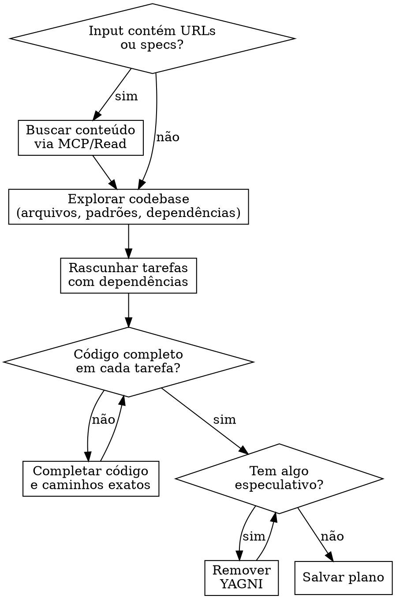

# Roadmap

## Visão Geral

Cria planos de implementação que podem ser executados por um agente sem contexto adicional. Cada tarefa é atômica, com caminhos exatos, código completo e dependências explícitas.

**Princípio fundamental:** Um bom plano é tão claro e detalhado que pode ser executado por um agente que não conhece o codebase. Se o agente precisar adivinhar algo, o plano está incompleto.

Input do usuário:
```
$ARGUMENTS
```

**Anunciar no início:** "Estou usando a skill `roadmap` para criar um plano de implementação. Vou seguir um processo estruturado para garantir que o plano seja claro, detalhado e fácil de seguir."
**Salvar planos em:** `.workflow/plans/AAAA-MM-DD-<nome-da-funcionalidade>.md`

## Quando Usar

- Especificação pronta que precisa virar tarefas de implementação
- Requisitos claros para uma funcionalidade de várias etapas
- Migração, refatoração ou feature que toca múltiplos arquivos

**Não usar para:** Ideias vagas (use `/spec`), bugs simples, ou tarefas de um único arquivo.

## Processo



### 1. Coletar contexto

- Se o input contiver URLs (Notion, Jira, specs), busque o conteúdo antes de qualquer outra coisa
- Se existir uma spec em `.workflow/specs/`, leia-a completamente

### 2. Explorar o codebase

**OBRIGATÓRIO antes de escrever qualquer tarefa.**

- Identifique arquivos existentes que serão modificados (com números de linha)
- Entenda padrões do projeto (convenções de nomes, estrutura de pastas, imports)
- Verifique dependências instaladas e disponíveis
- Documente código e documentação que o executor precisará consultar

### 3. Rascunhar tarefas

- Divida a implementação em tarefas atômicas
- Defina dependências explícitas entre tarefas
- Tarefas independentes podem ser executadas em paralelo

### 4. Completar código em cada tarefa

- Escreva o código completo — nunca "adicionar validação" ou "implementar lógica"
- Use caminhos exatos de arquivo com números de linha para modificações
- Referencie funcionalidades relevantes com a sintaxe `@`

### 5. Revisar YAGNI

- Remova qualquer funcionalidade não solicitada explicitamente
- Sem "próximas fases", "melhorias futuras", "nice-to-have"

### 6. Salvar e finalizar

- Salve no caminho: `.workflow/plans/AAAA-MM-DD-<nome-da-funcionalidade>.md`
- Siga para a Finalização

## Cabeçalho do Documento de Plano

**Todo plano DEVE começar com este cabeçalho:**

```markdown
# Plano de Implementação: [Nome da Funcionalidade]

> **Para Claude:** Este plano deve ser executado usando a skill `workflow:build`.

**Objetivo:** [Uma frase descrevendo o que isso constrói]

**Contexto:** [2-3 frases sobre o problema que resolve]

**Arquitetura:** [2-3 frases sobre a abordagem técnica]

**Pilha de Tecnologias:** [Tecnologias/bibliotecas principais]
```

## Estrutura da Tarefa

**Toda tarefa DEVE seguir este formato:**

```markdown
### Tarefa N: [Nome do Componente]

**Objetivo:** [Uma frase descrevendo o que esta tarefa entrega]

**Depende de:** Tarefa X, Tarefa Y (ou "Nenhuma")

**Arquivos:**

- Criar: `caminho/exato/para/arquivo.py`
- Modificar: `caminho/exato/para/existente.py:123-145`

**Implementação:**

[código completo aqui]
```

**Sobre o campo `Depende de:`:**
- Obrigatório em TODAS as tarefas — sem exceção
- Usar "Nenhuma" para tarefas independentes
- Dependências determinam a ordem de execução (tarefas independentes são executadas em paralelo)

## Regras Invioláveis

**Violar a letra das regras É violar o espírito das regras.**

### Explorar o codebase ANTES de planejar — SEMPRE

Nunca escreva um plano sem antes ler os arquivos relevantes do projeto. Planos genéricos são inúteis.

**Sem exceções:**
- Não importa se "já conhece o framework"
- Não importa se o usuário tem pressa
- Não importa se "é uma stack comum"
- Cada projeto tem padrões únicos. Descubra-os antes de planejar

### Caminhos exatos de arquivo — SEMPRE

Todo arquivo referenciado no plano DEVE ter caminho exato a partir da raiz do projeto. Para modificações, inclua números de linha.

**Sem exceções:**
- Não use `src/middleware/` sem o nome do arquivo completo
- Não use "adaptar models existentes" — diga QUAL arquivo e QUAIS linhas
- Não invente caminhos — verifique que existem no codebase

### Criar vs Modificar — distinção obrigatória

Use "Criar" APENAS para arquivos novos que não existem. Use "Modificar" para arquivos existentes, SEMPRE com números de linha.

**Sem exceções:**
- Se o arquivo já existe no codebase, é "Modificar", não "Criar"
- "Modificar" SEMPRE inclui números de linha (ex: `arquivo.js:15-30`)
- Nunca reescreva um arquivo existente inteiro — modifique apenas as linhas necessárias

### Código completo — SEMPRE

Toda seção de **Implementação** DEVE conter código funcional e completo, pronto para copiar e usar.

**Sem exceções:**
- Não use "implementar lógica de validação" — escreva a validação
- Não use "adicionar tratamento de erro" — escreva o try/catch
- Não use "criar interfaces genéricas" — escreva a interface
- Se o código é longo demais, a tarefa precisa ser dividida — não truncada

### DRY e YAGNI — SEMPRE

Inclua apenas o que foi solicitado. Não repita código entre tarefas.

**Sem exceções:**
- Não inclua "Próximas Fases" ou "Pós-MVP"
- Não inclua OAuth, 2FA, i18n se não foi pedido
- Não inclua seções de "Riscos", "Timeline", "Critérios de Sucesso" — isso é gerência de projeto, não implementação
- Não inclua estimativas de tempo — nunca
- Não defina o mesmo código em duas tarefas diferentes (ex: associações de models devem existir em apenas uma tarefa)

### Tarefas atômicas, não fases de projeto — SEMPRE

Cada tarefa entrega um componente funcional específico. Não use "Fase 1: Preparação" ou "Fase 2: Desenvolvimento".

**Sem exceções:**
- Não agrupe múltiplas responsabilidades em uma "fase"
- Não crie tarefas como "Setup de infraestrutura" com 20 sub-itens
- Uma tarefa = um componente/arquivo/funcionalidade claro
- Se tem mais de 3 arquivos, considere dividir

### Campo "Depende de" em todas as tarefas — SEMPRE

**Sem exceções:**
- Não pule o campo porque "é óbvio"
- Não assuma que o leitor sabe a ordem
- "Nenhuma" é uma resposta válida — use quando aplicável

## Racionalizações Comuns — NÃO CAIA NESSAS

| Desculpa | Realidade |
|----------|-----------|
| "Ser abrangente é melhor" | Abrangente ≠ genérico. Um plano abrangente tem código completo e caminhos exatos, não seções de riscos e timelines. |
| "O usuário tem pressa, não dá para explorar o codebase" | Pressa torna a exploração MAIS importante. Um plano genérico que não funciona desperdiça mais tempo. |
| "É uma stack comum, já sei os padrões" | Cada projeto é diferente. O arquivo pode se chamar `auth.middleware.ts`, não `authMiddleware.js`. Verifique. |
| "Timeline ajuda a planejar" | O plano é para um AGENTE executar, não para uma reunião de sprint. Agentes não precisam de timelines. |
| "Incluir riscos é ser prudente" | Riscos são gerência de projeto. O plano é implementação. Foque no código. |
| "Vou deixar o código abstrato para flexibilidade" | Código abstrato = código incompleto. Escreva o código real. Se precisar mudar, muda depois. |
| "A tarefa é simples demais para ter 'Depende de'" | Simples ou complexa, o campo é obrigatório. O agente executor precisa saber a ordem. |
| "'Implementar lógica' é claro o suficiente" | Não é. "Implementar lógica" pode significar 100 coisas diferentes. Escreva o código. |
| "Vou reescrever o arquivo inteiro, é mais fácil" | Se o arquivo já existe, modifique apenas as linhas necessárias. Reescrever perde contexto e quebra código. |
| "Vou definir as associações em cada model" | DRY. Defina associações em um único lugar. Duplicar código entre tarefas cria inconsistências. |

## Red Flags — PARE e Reconsidere

Se você se pegar pensando qualquer um destes, PARE:

- "Vou criar o plano sem explorar o codebase, já conheço essa stack"
- "Vou usar caminhos genéricos como `src/controllers/`"
- "Vou escrever 'implementar validação' em vez do código real"
- "Vou adicionar uma seção de riscos e timeline"
- "Vou incluir OAuth/2FA/i18n mesmo sem ser pedido"
- "Vou usar 'fases' em vez de tarefas atômicas"
- "Vou pular o campo 'Depende de' porque é óbvio"
- "Vou usar 'Criar' para reescrever um arquivo existente"
- "Vou duplicar este código em outra tarefa por conveniência"
- "Isso é diferente porque..."

**Todos esses significam: Siga as regras. Sem exceções.**

## Finalização

Após salvar o plano, informe o caminho do arquivo salvo, pergunte se o usuário precisa de alguma alteração e recomende limpar a janela de contexto antes de executar a próxima etapa (`/build`).